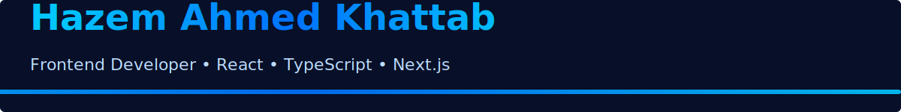

# 👋 Hi, I'm Hazem Khattab

### Frontend Developer | React.js | TypeScript | Next.js

<!-- Banner: upload the banner image to the repo root with the filename below -->


---

I'm a passionate Frontend Developer who loves building clean, responsive, and user-friendly web applications. I focus on writing clean code, optimizing performance, and delivering great user experiences.

---

## ✨ Animated Header (professional touch)

To make animation appear reliably in your GitHub profile README we provide two compatible options. **Use the SVG (SMIL) below first** — it often works when opened raw and sometimes appears in README. If it doesn’t animate in README, use the GIF fallback (most reliable).

### ✅ Option 1 — SVG (SMIL animation — higher quality, vector)

1. Create a file named `header-anim.svg` in the repo root and paste the code below into it.
2. Reference it in the README with:

```md

```

**Use this SVG (SMIL) — recommended:**

```svg
<?xml version="1.0" encoding="utf-8"?>
<svg xmlns="http://www.w3.org/2000/svg" width="1200" height="140" viewBox="0 0 1200 140" role="img" aria-label="Animated header">
  <rect width="1200" height="140" fill="#071028" rx="6"/>
  <g transform="translate(40,32)">
    <text x="0" y="0" font-family="Segoe UI, Roboto, Arial" font-weight="700" font-size="44" fill="#ffffff">Hazem Ahmed Khattab</text>
    <text x="0" y="46" font-family="Segoe UI, Roboto, Arial" font-weight="400" font-size="20" fill="#bcdcff">Frontend Developer • React • TypeScript • Next.js</text>
  </g>

  <!-- animated gradient bar using SMIL animation -->
  <defs>
    <linearGradient id="g1" x1="0" x2="1">
      <stop offset="0%" stop-color="#00c6ff"/>
      <stop offset="50%" stop-color="#0072ff"/>
      <stop offset="100%" stop-color="#00c6ff"/>
    </linearGradient>
  </defs>

  <rect x="-400" y="120" width="1600" height="6" rx="3" fill="url(#g1)">
    <animate attributeName="x" from="-400" to="0" dur="3s" repeatCount="indefinite" />
  </rect>

  <!-- subtle pulsing dot animation -->
  <circle cx="1100" cy="40" r="4" fill="#00c6ff">
    <animate attributeName="r" values="4;8;4" dur="1.6s" repeatCount="indefinite" />
    <animate attributeName="opacity" values="1;0.4;1" dur="1.6s" repeatCount="indefinite" />
  </circle>
</svg>
```

> Tip: After uploading, open the raw file link `https://raw.githubusercontent.com/<username>/<repo>/main/header-anim.svg` to confirm the animation plays in the browser. If it does there but not inside README, GitHub is sanitizing it when embedded.

---

### ✅ Option 2 — GIF fallback (most reliable on GitHub)

1. Create/export an animated GIF named `header-anim.gif` and upload to repo root.
2. Reference it in the README with:

```md

```

**How to make a GIF quickly:**

* Use an online converter (e.g. ezgif.com) to convert an MP4 or sequence of PNG frames to a GIF, then optimize (compress) the GIF.
* Or use ImageMagick locally:

```bash
# from PNG frames named frame01.png frame02.png ...
convert -delay 8 -loop 0 frame*.png header-anim.gif
# optimize if gifsicle is available
gifsicle -O3 header-anim.gif -o header-anim-optimized.gif
```

---

### Quick checklist after adding files

* File names: `header-anim.svg` or `header-anim.gif` (no spaces). Use lower-case and dashes/underscores.
* Files in repo root or update path in README accordingly.
* Push to default branch (e.g. `main`) — GitHub shows README from default branch.
* Open raw link to verify SVG animation plays in browser. If SVG plays raw but not embedded, use GIF fallback.

---

## 🚀 Technologies & Tools

* **Frontend:** HTML, CSS, JavaScript, TypeScript, React.js, Next.js
* **State Management:** Redux Toolkit, Context API
* **UI Frameworks:** TailwindCSS, Material UI, Bootstrap, Sass
* **Tools:** Git, GitHub, Postman
* **Other:** JWT Authentication, APIs, Responsive Design

---

## 📌 Featured Projects

### 🔹 Smart Trash – Graduation Project

Dashboard + Real-time monitoring system for smart waste management. Includes charts, alerts, sensors integration, and admin UI.

🔗 **Live Demo:** [https://smart-trash-deployment.vercel.app/](https://smart-trash-deployment.vercel.app/)

---

## 📫 Contact Me

* **Email:** [hazemkhattab222@gmail.com](mailto:hazemkhattab222@gmail.com)
* **LinkedIn:** [https://www.linkedin.com/in/hazem-ahmed-khattab1/](https://www.linkedin.com/in/hazem-ahmed-khattab1/)
* **GitHub:** [https://github.com/hazemkhattab](https://github.com/hazemkhattab)

---

⭐ Feel free to check out my projects or contact me for collaboration!

---

## ✅ Quick steps to apply this README to your GitHub profile

1. In GitHub create a repository with your exact GitHub username (e.g. `hazemkhattab`).
2. Add this `README.md` file to the repository root.
3. Upload the banner image file `A_LinkedIn_banner_in_digital_graphic_design_format.png` to the repo root (or rename it to `banner.png` and update the reference above).
4. (Optional) Add `header-anim.svg` or `header-anim.gif` to the repo root for the animated header.
5. Commit and push — GitHub will show this README on your profile.

If you want, I can:

* Generate a ready-to-upload `header-anim.svg` file for you, or
* Export an animated GIF version of the header, or
* Directly commit these files to your repo if you give me the repo link and permission.
